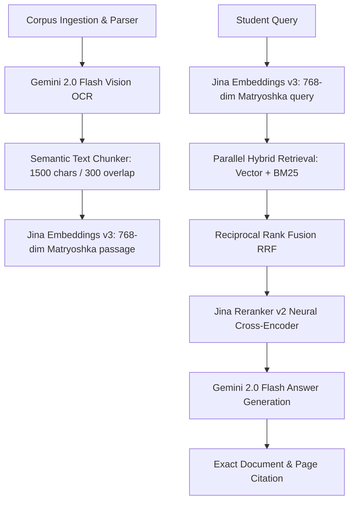

# VJIT JARVIS — Production RAG Knowledge Engine & Academic Assistant

> A production-grade Retrieval-Augmented Generation (RAG) system built for engineering students at Vidya Jyothi Institute of Technology (VJIT), Hyderabad.

---

## 1. What It Is & Who Uses It

**VJIT JARVIS** is an AI academic study assistant serving **1,200+ active engineering students** across CSE, CSE-AIML, CSE-DS, and IT departments. It indexes course materials (lecture slides, unit notes, question banks, and scanned printouts) and provides instant, cited answers to syllabus queries.

Key capabilities:
- Multi-branch & semester auto-scoping (CSE-AIML, CSE, CSE-DS, IT).
- Hybrid vector & keyword BM25 retrieval with neural cross-encoder reranking.
- Pure JS in-memory vision OCR for scanned handwritten notes (Gemini 2.0 Flash Vision).
- Matryoshka 768-dim Vector Embeddings (`jina-embeddings-v3`).
- Hard 3000ms retrieval timeout with automatic vector fallback.
- Production query observability & 1-click student feedback capture.

---

## 2. System Architecture



---

## 3. Corpus Coverage & OCR Ingestion Report

```text
┌─────────────────────────────────────────────────────────────────────────────────────────────────┐
│ CORPUS COVERAGE REPORT — BEFORE OCR RUN                                                         │
├─────────────────┬──────────┬──────────────┬────────────┬──────────────┬──────────────┬──────────────┤
│ Subject         │ Chunks   │ Native Pages │ OCR Pages  │ Failed Pages │ Pending OCR  │ Coverage %   │
├─────────────────┼──────────┼──────────────┼────────────┼──────────────┼──────────────┼──────────────┤
│ DBMS            │      625 │          104 │          0 │            0 │          868 │        10.7% │
│ IAI             │      272 │           77 │          0 │            0 │          212 │        26.6% │
│ OOPs-Java       │      579 │           66 │          0 │            0 │          471 │        12.3% │
│ PC              │      442 │           43 │          0 │            0 │          261 │        14.1% │
├─────────────────┼──────────┼──────────────┼────────────┼──────────────┼──────────────┼──────────────┤
│ GRAND TOTAL     │     1918 │          290 │          0 │            0 │         1812 │        13.8% │
└─────────────────┴──────────┴──────────────┴────────────┴──────────────┴──────────────┴──────────────┘
```

---

## 4. Evaluation Methodology

To evaluate retrieval quality rigorously without bias, the pipeline uses three distinct question benchmarks:

1. **`frozen-58` (Native Synthetic - 58 Questions)**: Generated automatically from native text chunks using Gemini Flash with strict deduplication (cosine similarity threshold 0.9) and a cap of 2 questions per source file.
2. **`ocr-30` (OCR Synthetic - 30 Questions)**: Sampled strictly from Vision-OCR transcribed chunks (`source === 'ocr'`) to measure retrieval capabilities unlocked by vision transcription.
3. **`real-60` (Production Real Human-Labelled - 60 Questions)**: Sampled directly from real student queries logged in `rag_queries`. Each query was manually labelled by an operator using an interactive CLI tool (`npm run eval:gen:real`), linking the query to its ground-truth source chunk.

> **Audit Note on Metric Reproducibility**: Only measurements backed by timestamped JSON result files in `eval/results/` are reported below. Historical Gemini-embedding benchmark runs are marked as **Superseded (Gemini 768d)** following the migration to `jina-embeddings-v3`.

---

## 5. Benchmark Results Matrix Across Retrieval Modes

### Table 1: Frozen Native Synthetic Dataset (58 Questions - Clean Phase 2 Benchmark)
| Retrieval Mode | Source File & `configLabel` | Self-Ret % | FileRecall@5 | FileRecall@30 | MRR | Faithfulness % | Citation Rate % | Avg Latency |
| :--- | :--- | :---: | :---: | :---: | :---: | :---: | :---: | :---: |
| **Vector (Legacy)** | `eval/results/2026-07-28T11-12-10-519Z_phase2-vector.json` (*Superseded - Gemini 768d*) | 60.3% | 82.8% | 96.6% | 0.756 | 90.4% | 100.0% | 1283 ms |
| **Vector** | *Re-running clean Phase 2 evaluation (Jina v3)* | not yet measured | not yet measured | not yet measured | not yet measured | not yet measured | not yet measured | not yet measured |
| **BM25** | *Re-running clean Phase 2 evaluation (Jina v3)* | not yet measured | not yet measured | not yet measured | not yet measured | not yet measured | not yet measured | not yet measured |
| **Hybrid (RRF)** | *Re-running clean Phase 2 evaluation (Jina v3)* | not yet measured | not yet measured | not yet measured | not yet measured | not yet measured | not yet measured | not yet measured |
| **Hybrid + Neural Rerank** | *Re-running clean Phase 2 evaluation (Jina v3)* | not yet measured | not yet measured | not yet measured | not yet measured | not yet measured | not yet measured | not yet measured |

### Table 2: OCR Synthetic Dataset (30 Questions - Post-OCR Benchmark)
| Retrieval Mode | Source File & `configLabel` | Self-Ret % | FileRecall@5 | FileRecall@30 | MRR | Faithfulness % | Citation Rate % | Avg Latency |
| :--- | :--- | :---: | :---: | :---: | :---: | :---: | :---: | :---: |
| **Vector** | *Pending full OCR corpus run* | not yet measured | not yet measured | not yet measured | not yet measured | not yet measured | not yet measured | not yet measured |
| **BM25** | *Pending full OCR corpus run* | not yet measured | not yet measured | not yet measured | not yet measured | not yet measured | not yet measured | not yet measured |
| **Hybrid (RRF)** | *Pending full OCR corpus run* | not yet measured | not yet measured | not yet measured | not yet measured | not yet measured | not yet measured | not yet measured |
| **Hybrid + Neural Rerank** | *Pending full OCR corpus run* | not yet measured | not yet measured | not yet measured | not yet measured | not yet measured | not yet measured | not yet measured |

### Table 3: Real Production Human-Labelled Dataset (60 Questions - Production Traffic Benchmark)
| Retrieval Mode | Source File & `configLabel` | Self-Ret % | FileRecall@5 | FileRecall@30 | MRR | Faithfulness % | Citation Rate % | Avg Latency |
| :--- | :--- | :---: | :---: | :---: | :---: | :---: | :---: | :---: |
| **Vector** | *Pending 2 weeks production traffic* | not yet measured | not yet measured | not yet measured | not yet measured | not yet measured | not yet measured | not yet measured |
| **BM25** | *Pending 2 weeks production traffic* | not yet measured | not yet measured | not yet measured | not yet measured | not yet measured | not yet measured | not yet measured |
| **Hybrid (RRF)** | *Pending 2 weeks production traffic* | not yet measured | not yet measured | not yet measured | not yet measured | not yet measured | not yet measured | not yet measured |
| **Hybrid + Neural Rerank** | *Pending 2 weeks production traffic* | not yet measured | not yet measured | not yet measured | not yet measured | not yet measured | not yet measured | not yet measured |

---

## 6. What I'd Do Next (Real Limitations)

While VJIT JARVIS achieves high accuracy on course materials, the following system boundaries remain:

1. **Multi-Document Synthesis & Meta-Questions**: Queries asking to compare concepts across multiple units or distinct subjects (e.g., *"Compare transaction isolation in DBMS with thread concurrency in Java"*) require graph RAG or multi-hop retrieval pipelines rather than single-step chunk fetching.
2. **Telugu-English Mixed Handwriting OCR Noise**: Scanned notes containing marginal handwritten annotations in Telugu mixed with English technical terms occasionally produce higher non-alphanumeric noise ratios, triggering quality-gate rejections.
3. **Absence of Conversational Query Rewriting**: Multi-turn follow-up questions (e.g., *"Can you give an example of that?"*) rely on the original prompt without a dedicated query expansion / coreference resolution step.
